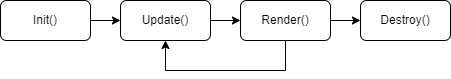

# <p align="center"> Reactea </p>

<div align="center">

[](https://img.shields.io/github/v/tag/londek/reactea?label=latest)
[](https://github.com/londek/reactea/actions/workflows/build.yml)

[](https://pkg.go.dev/github.com/londek/reactea)
[](https://goreportcard.com/report/github.com/londek/reactea)

Rather simple **Bubbletea companion** for **handling hierarchy**, support for **lifting state up.**\
It Reactifies Bubbletea philosophy and makes it especially easy to work with in bigger projects.

For me, personally - **It's a must** in project with multiple pages and component communication

Check our quickstart [right here](#quickstart) or other examples [here!](/examples)

`go get -u github.com/londek/reactea`
</div>

## General info

The goal is to create components that are

- dimensions-aware (especially unify all setSize conventions)
- scallable
- more robust
- easier to code
- all of that without code duplication

Extreme performance is not main goal of this package, however it should not be
that far off actual Bubbletea which is already blazing fast.
Most info is currently in source code so I suggest checking it out

Always return `reactea.Destroy` instead of `tea.Quit` in order to follow our convention (that way Destroy() will be called on your components)

As of now Go doesn't support type aliases for generics, so `Renderer[TProps]` has to be explicitly casted.

## [Quickstart](/examples/quickstart)

Reactea unlike Bubbletea implements two-way communication, very React-like communication.\
If you have experience with React you are gonna love Reactea straight away!

In this tutorial we are going to make application that consists of 2 pages.

- The `/input` (aka `index`, in reactea `default`) page for inputting your name
- The `/displayname` page for displaying your name

### [Lifecycle](#component-lifecycle)

More detailed docs about component lifecycle can be found [here](#component-lifecycle), we are only gonna go through basics.

Reactea component lifecycle consists of 6 methods (while Bubbletea only 3)
|Method|Purpose|
|-|-|
| `Init() tea.Cmd` | It's called first. All critical stuff should happen here. It also supports IO through tea.Cmd |
| `Update(tea.Msg) tea.Cmd` | It reacts to Bubbletea IO and updates state accordingly |
| `Render(int, int) string` | It renders the UI. The two arguments are width and height, they should be calculated by parent |
| `Destroy()` | It's called whenever Component is about to end it's lifecycle. Please note that it's parent's responsibility to call `Destroy()` |

Let's get to work!

### The `/input` page

`/pages/input/input.go`

```go
type Component struct {
    reactea.BasicComponent                // It implements all reactea's core functionalities

    // Props
    SetText func(string)

    textinput textinput.Model             // Input for inputting name
}

func New() *Component {
    return &Component{textinput: textinput.New()}
}

func (c *Component) Init() tea.Cmd {
    return c.textinput.Focus()
}

func (c *Component) Update(msg tea.Msg) tea.Cmd {
    switch msg := msg.(type) {
    case tea.KeyMsg:
        if msg.Type == tea.KeyEnter {
            // Lifted state power! Woohooo
            c.SetText(c.textinput.Value())

            // Navigate to displayname, please
            reactea.SetRoute("/displayname")
            return nil
        }
    }

    var cmd tea.Cmd
    c.textinput, cmd = c.textinput.Update(msg)
    return cmd
}

// Here we are not using width and height, but you can!
func (c *Component) Render(int, int) string {
    return fmt.Sprintf("Enter your name: %s\nAnd press [ Enter ]", c.textinput.View())
}
```

#### The `/displayname` page

`/pages/displayname/displayname.go`

```go
import (
 "fmt"
)

// Our prop(s) is a string itself!
type Props = string

// Stateless components?!?!
func Renderer(text Props, width, height int) string {
    return fmt.Sprintf("OMG! Hello %s!", text)
}
```

### Main component

`/app/app.go`

```go
type Component struct {
    reactea.BasicComponent                // It implements all reactea's core functionalities

    mainRouter reactea.Component[router.Props]      // Our router

    text string // The name
}

func New() *Component {
    return &Component{
        mainRouter: router.New(),
    }
}

func (c *Component) Init(reactea.NoProps) tea.Cmd {
    // Does it remind you of something? react-router!
    return c.mainRouter.Init(map[string]router.RouteInitializer{
        "default": func(router.Params) reactea.Component {
			component := input.New()

			component.SetText = c.setText

			return component
		},
		"/displayname": func(router.Params) reactea.Component {
            // RouteInitializer requires Component so we have to convert
            // Stateless component (renderer) to Component
			return reactea.Componentify(displayname.Render, c.text)
		},
    })
}

func (c *Component) Update(msg tea.Msg) tea.Cmd {
    switch msg := msg.(type) {
    case tea.KeyMsg:
        // ctrl+c support 
        if msg.String() == "ctrl+c" {
            return reactea.Destroy
        }
    }

    return c.mainRouter.Update(msg)
}

func (c *Component) Render(width, height int) string {
    return c.mainRouter.Render(width, height)
}

func (c *Component) setText(text string) {
    c.text = text
}
```

#### Main

`main.go`

```go
// reactea.NewProgram initializes program with
// "translation layer", so Reactea components work
program := reactea.NewProgram(app.New())

if _, err := program.Run(); err != nil {
    panic(err)
}
```

## Component lifecycle



Reactea component lifecycle consists of 6 methods (while Bubbletea only 3)
|Method|Purpose|
|-|-|
| `Init() tea.Cmd` | It's called first. All critical stuff should happen here. It also supports IO through tea.Cmd |
| `Update(tea.Msg) tea.Cmd` | It reacts to Bubbletea IO and updates state accordingly |
| `Render(int, int) string` | It renders the UI. The two arguments are width and height, they should be calculated by parent |
| `Destroy()` | It's called whenever Component is about to end it's lifecycle. Please note that it's parent's responsibility to call `Destroy()` |

Reactea takes pointer approach for components making state modifiable in any lifecycle method\

### Notes

`Update()` **IS NOT** guaranteed to be called on first-run, `Init()` for most part is, and critical logic should be there

## Stateless components

Stateless components are represented by following function types

|                | Renderer[TProps any]     | ProplessRenderer   | DumbRenderer  |
|----------------|:------------------------:|:------------------:|:-------------:|
| **Properties** | ✅                       | ❌                | ❌            |
| **Dimensions** | ✅                       | ✅                | ❌            |
| **Arguments** | `TProps, int, int`        | `int, int`         | ❌            |

There are many utility functions for transforming stateless into stateful components or for rendering any component without knowing its type (`reactea.RenderAny`)

## Routes API

Routes API allows developers for easy development of multi-page apps.
They are kind of substitute for window.Location inside Bubbletea

### reactea.CurrentRoute() Route

Returns current route

### reactea.LastRoute() Route

Returns last route

### reactea.WasRouteChanged() bool

returns `LastRoute() != CurrentRoute()`

## Reactea Routes now support params

Params have been introduced in order to allow routes like: `/teams/123/player/4`

Params have to follow regex `^:.*$`\
`^` being beginning of current path level (`/^level/`)\
`$`being end of current path level (`/level$/`)

Note that params support wildcards with single `:`, like `/teams/:/player`. `/teams/123/player`, `/teams/456/player` etc will be matched no matter what and param will be ignored in param map.

## Router Component

Router Component is basic implementation of how routing could look in your application.
It doesn't support wildcards yet or relative pathing. All data is provided from within props

### router.Props

router.Props is a map of route initializers keyed by routes

What is `RouteInitializer`?

`RouteInitializer` is function that initializes the current route component
